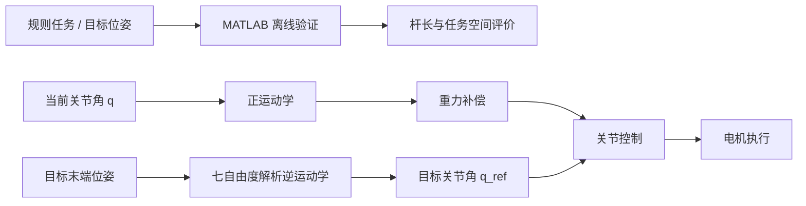

# TaurusArm

> 华南农业大学 Taurus 战队 2026 赛季工程机器人  
> RoboMaster「嵌入式、控制」方向开源

TaurusArm 整理自 Taurus 战队 2026 赛季工程机器人实际开发代码，主要包含两部分：

- `matlab/`：六自由度机械臂杆长、任务空间与完整任务轨迹的离线验证代码；
- `cpp/`：七自由度机械臂运动学、重力补偿及相关空间数学运算的核心 C 代码。

本仓库以**关键算法开源**为目的，不提供完整 CubeMX、FreeRTOS、CAN、Motor、整车状态机或比赛业务工程。

---

## 开源范围

### MATLAB

`matlab/` 为完整的六自由度机械臂离线验证代码，可用于：

- 建立机械臂 DH 模型；
- 生成比赛任务目标位姿；
- 计算 `Transl / P_Rotate / Q_Rotate` 三阶段完整任务轨迹；
- 调用六自由度几何逆运动学；
- 遍历杆长、任务目标与基座位置；
- 统计 Coverage、Adaptability 与 Perfect Ratio；
- 绘制不同杆长组合的评价结果。

### C / STM32

`cpp/` 仅整理并公开赛季工程中与机械臂算法直接相关的核心代码，包括：

- 七自由度正运动学；
- 固定 J3 的七自由度解析逆运动学；
- 重力补偿核心计算；
- DH / 齐次变换 / Rodrigues 旋转等空间数学工具。

C 代码**不是完整 STM32 工程**。实际移植时需由使用者根据自己的机器人补充：

- 机械臂尺寸与 DH / MDH 参数；
- 关节限位；
- Tool / Base 坐标变换；
- Link 质量与质心参数；
- `main.h`、`kinematics_types.h` 等项目级类型和宏；
- FreeRTOS、CAN、电机驱动及整车业务代码；
- 电机正方向、力矩 / 电流映射与安全保护。

---

## 开源内容

### MATLAB：六自由度结构与任务空间验证

| 文件 | 作用 |
| --- | --- |
| `get_robot_description.m` | 建立六自由度 `SerialLink` 模型、关节限位与 Tool 变换 |
| `get_target_description.m` | 生成任务目标及 Transl、P 轴旋转、Q 轴旋转阶段的目标位姿 |
| `calculate_scene_trajectory.m` | 对完整任务流程逐帧进行逆解与关节限位检查 |
| `my_Inverse_solution.m` | 六自由度几何逆运动学 |
| `run_arm_optimization.m` | 遍历杆长、目标与基座候选，统计 Coverage、Adaptability、Perfect Ratio |

### C / STM32：七自由度机械臂核心算法

| 目录 | 文件 | 作用 |
| --- | --- | --- |
| `cpp/Core/` | `forward_kinematics.c/.h` | 七自由度机械臂模型、正运动学及 World / Base / Tool 坐标变换 |
| `cpp/Core/` | `inverse_kinematics.c/.h` | 固定 J3 的七自由度解析逆解、数学分支选择、关节限位与连续性处理 |
| `cpp/Dynamics/` | `gravity_compensation.c/.h` | Link 质心转换、重力矩计算及关节轴投影 |
| `cpp/Math/` | `TFMtrix_mathlib.c/.h` | DH 变换、齐次矩阵、姿态变换、误差计算与旋转矩阵处理 |
| `cpp/Math/` | `vector_mathlib.c/.h` | 向量、叉乘、Rodrigues 旋转、空间轴线与方向运算 |

---

## 技术框架



MATLAB 主要用于结构定型前的离线评价；C 代码主要对应后续七自由度机械臂在 STM32H723 上的嵌入式实现。

---

## 目录结构

```text
TaurusArm/
├── README.md
├── LICENSE
├── .gitignore
├── cpp/
│   ├── Core/
│   │   ├── forward_kinematics.c
│   │   ├── forward_kinematics.h
│   │   ├── inverse_kinematics.c
│   │   └── inverse_kinematics.h
│   ├── Dynamics/
│   │   ├── gravity_compensation.c
│   │   └── gravity_compensation.h
│   └── Math/
│       ├── TFMtrix_mathlib.c
│       ├── TFMtrix_mathlib.h
│       ├── vector_mathlib.c
│       └── vector_mathlib.h
└── matlab/
    ├── calculate_scene_trajectory.m
    ├── get_robot_description.m
    ├── get_target_description.m
    ├── my_Inverse_solution.m
    └── run_arm_optimization.m
```

---

## 开发环境

### MATLAB

- MATLAB R2024b
- Peter Corke Robotics Toolbox for MATLAB
- MATLAB Parallel Computing Toolbox

MATLAB 代码使用了：

```text
Link
SerialLink
transl
trotx / troty / trotz
parpool / parfor
```

### C / STM32

- STM32H723
- MDK
- C99
- CMSIS-DSP / `arm_math.h`

C 目录只包含算法相关源文件，不包含完整板级工程。

---

## 快速开始

### MATLAB

将 `matlab/` 加入 MATLAB 工作目录后：

```matlab
cd matlab

robot = get_robot_description();

results = run_arm_optimization();
```

`run_arm_optimization.m` 默认提供一组可直接运行的杆长、任务位姿和基座遍历配置。

可以根据计算资源和验证精度，直接修改文件开头的：

- 杆长扫描范围；
- 目标位姿采样范围；
- 基座位置；
- 任务轨迹帧数；
- 起始姿态搜索步长。

完整参数扫描会使用 `parpool / parfor` 进行并行计算。

### C / STM32

将所需的：

```text
cpp/Core/
cpp/Dynamics/
cpp/Math/
```

中的 `.c/.h` 文件加入现有 STM32H723 工程，并配置对应 Include Path。

典型依赖关系：

```text
Math
  ↓
Core / Forward Kinematics
  ↓
Inverse Kinematics
  ↓
Gravity Compensation
```

当前仓库不提供完整可直接烧录的 STM32 工程，因此接入时需由目标工程补充机器人参数、基础类型、板级接口及控制任务。

---

## 模块说明

### 六自由度机械臂杆长与任务空间验证

早期结构选型不能只看随机工作空间点云，因为“能够到达某个点”并不代表机械臂可以完成整个比赛任务流程。

因此 MATLAB 部分直接对完整任务进行验证：

```text
杆长组合
×
任务目标
×
基座位置
×
Transl / P_Rotate / Q_Rotate 完整轨迹
```

并统计三项指标：

- **Coverage**：能够完成的任务比例；
- **Adaptability**：任务对不同基座位置的适应程度；
- **Perfect Ratio**：在全部候选基座位置下均可完成的任务比例。

---

### 七自由度解析逆运动学

七自由度机械臂具有一个冗余自由度。当前 C 实现采用固定 J3 的方式，将七自由度问题降维后进行解析求解。

主要流程包括：

```text
World / Tool 目标位姿
→ Base / Wrist 目标位姿
→ 固定 J3
→ J1 / J2 / J4 几何求解
→ J5 / J6 / J7 腕部姿态求解
→ 分支与限位筛选
→ q_sol
```

`IK_Solve_7DOF()` 为当前固定 J3 解析逆解入口，相关代码位于：

```text
cpp/Core/inverse_kinematics.c
```

---

### 重力补偿

重力补偿根据当前关节姿态计算各 Link 对关节产生的静态重力矩。

主要计算链路：

```text
当前关节角
→ 正运动学
→ 关节位置 / 关节轴 / Link 质心
→ r × mg
→ 投影到对应关节轴
→ 累加后级 Link
→ tau_gravity
```

核心思想是：叉乘得到的是三维空间力矩，因此最终还需要投影到当前真实关节轴方向，才能得到该电机对应的一维关节力矩。

相关代码：

```text
cpp/Dynamics/gravity_compensation.c
```

---

## 验证与实际应用

本仓库中的代码整理自 2026 赛季工程机器人实际开发过程。

目前对应技术已用于：

- 六自由度机械臂杆长与完整任务流程离线验证；
- 七自由度解析逆运动学 MATLAB / STM32 验证；
- STM32H723 上的七自由度机械臂运动学计算；
- 工程机器人机械臂重力补偿实车调试。

详细算法推导、MATLAB 仿真结果、STM32 运行记录以及实车视频将在配套 RoboMaster 技术报告 / 论坛文章中展示。

---

## 移植说明

### MATLAB

迁移到其他机械臂时，主要修改：

```text
get_robot_description.m
```

中的：

- DH 参数；
- Tool；
- 关节限位。

同时根据实际任务修改：

```text
get_target_description.m
run_arm_optimization.m
```

中的目标位姿、旋转轴、基座范围及采样范围。

### C / STM32

迁移七自由度机械臂算法时，需要根据目标机械臂确认：

- DH / MDH 参数；
- World → Base；
- End → Tool；
- 杆长与结构偏置；
- 关节零位与限位；
- Link 质量和质心；
- 关节轴方向；
- 电机正负方向；
- 力矩 / 电流映射。

当前 C 代码来源于 Taurus 赛季工程，固定 J3 解析逆解依赖当前机械臂构型，不能直接视为任意七自由度机械臂的通用逆解。

---

## RoadMap

后续可继续扩展：

- 更完整的机械臂碰撞检测；
- 七自由度冗余自由度优化；
- Cartesian impedance；
- Null-space control；
- 动力学参数辨识。

---

## License

本项目采用 [CC BY-NC-SA 4.0](https://creativecommons.org/licenses/by-nc-sa/4.0/)  
（署名—非商业性使用—相同方式共享 4.0 国际）许可证。

版权归华南农业大学 Taurus 战队所有。

第三方代码、库和依赖分别遵循其原始许可证，本仓库许可证不覆盖第三方内容。

---

